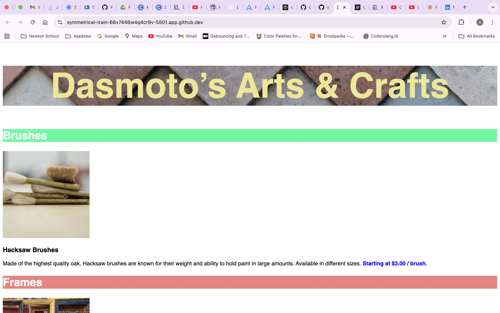

# CODECADEMY DASMOTO'S ARTS AND CRAFTS

This is a simple web project using the basics of HTML and CSS. It is about a fictional arts and crafts store, that sells common items for art like brushes, frames and paints.

## Table of Contents

- [Installation](#installation)
- [Usage](#usage)
- [Features](#features)
- [Technologies Used](#technologies)
- [Project Structure](#project-structure)
- [Screenshots](#screenshots)
- [Demo](#demo)
- [Contributing](#contributing)
- [License](#license)
- [Contact](#contact)
- [Acknowledgements](#acknowledgements)

## Installation

1. Open the folder in root in VS Code.
2. Install Live Server extension.

## Usage

1. Open in Live Preview.
2. The webpage opens up in a new browser on localhost:5500.

## Features

- Header having a background image and heading
- Main having 3 sections describing the 3 products: brushes, frames and paints.

## Technologies Used

- Frontend: HTML, CSS
- Tools: VS Code
- Deployment: Not deployed

## Project Structure

```md
codecademy--dasmoto-s-arts-and-crafts/
├── dasmotos-arts_redline.jpg
├── finnish.jpeg
├── frames.jpeg
├── hacksaw.jpeg
├── index.html
├── LICENSE
├── pattern.jpeg
├── README.md
└── style.css
```

## Screenshots



## Contributing

1. Fork the project
2. Create your feature branch (git checkout -b feature/AmazingFeature)
3. Commit your changes (git commit -m 'Add some AmazingFeature')
4. Push to the branch (git push origin feature/AmazingFeature)
5. Open a Pull Request

## License

This project is licensed under the MIT License - see the [LICENSE](./LICENSE) file for details.

## Contact

**Abhijit Kumar** - abhijitkumar10.5@gmail.com<br>
Project Link: https://abhijit105.github.io/codecademy--dasmoto-s-arts-and-crafts/

## Acknowledgements

- Based on the exercise ‘Off-Platform Project: Dasmoto's Arts & Crafts’ on Codecademy. This is my independent implementation. Prompt: [link](https://www.codecademy.com/journeys/front-end-engineer/paths/fecj-22-web-development-foundations/tracks/fecj-22-developing-websites-locally/modules/wdcp-22-developing-with-css-fed6b6e3-8e8d-4dbb-86db-cbe1d1827233/projects/dasmoto).
